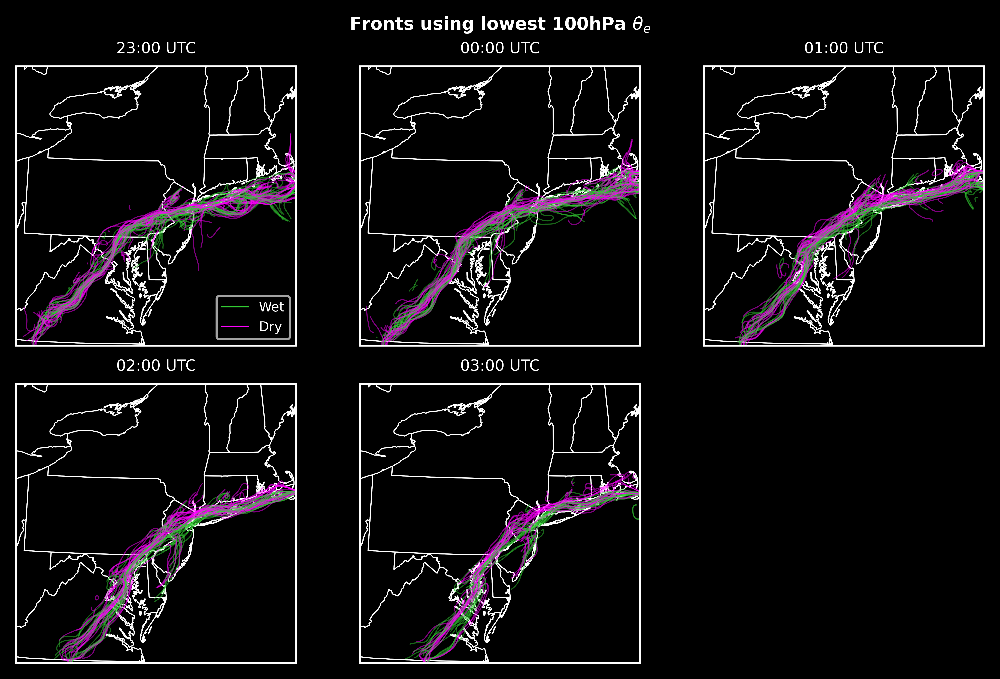

# Hurricane Ida & WoFS
Ty Janoski

---

# Reminder: Ida was bad for NYC

  
  
<em>Source: University at Albany</em>

---

# Huge spread among WoFS members

  
  
<em></em>

---

# Different spatial distribution and magnitude of precip

  
  
<em></em>

---

## Storms take different trajectories, sometimes missing NYC

  
  
<em></em>

---

# Related to different front positions

  
  
<em></em>

---

# Key Points

- Forecasted NYC rainfall in WoFS is highly sensitive to the synoptic circulation and the position of fronts
- NYC rainfall also sensitive to (not shown here):
  - Moisture and CAPE to the south of NYC
  - Southerly flow intersecting Ida's warm front
  - Cyclonic shear and a stronger warm front
- Manuscript in progress!