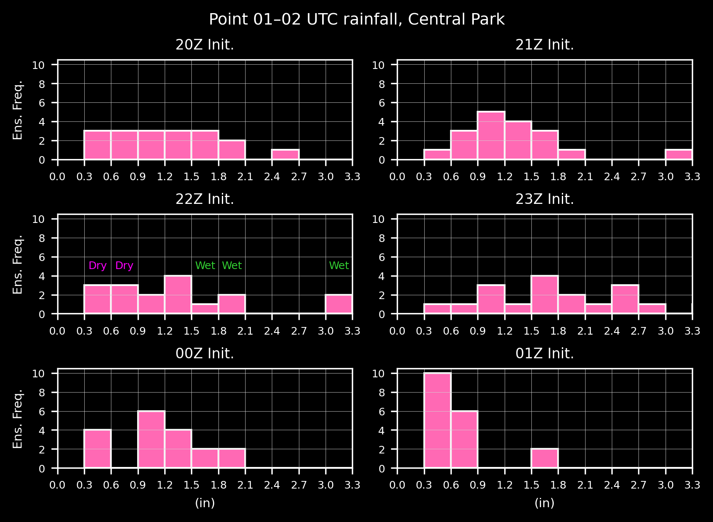
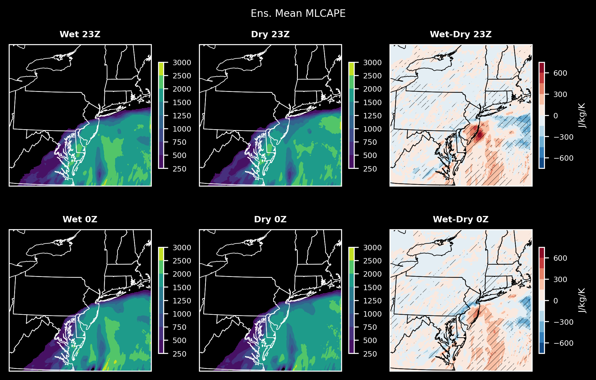

# Exploring Extreme Rainfall from Hurricane Ida using WoFS

Ty Janoski1,2, James Booth1, Thomas Galarneau2

1City College of New York
2NOAA National Severe Storms Laboratory

<!-- theme: gaia -->

---

## Background --  Ida
- Hurricane Ida's impacts on the New York City region cannot be understated
- Record-breaking hourly rainfall
  - **3.15" in Central Park**
  - **3.24" in Newark, NJ**
- NYC particularly susceptible to damage from urban flooding
  - Subways, basement apartments, etc.
- Dozens of deaths and significant damage to infrastructure

---

  
  
<em>Source: New York Times</em>

---

## Background -- Meteorological History of Ida
- Made landfall in Louisiana on August 29th as a Cat 4
- Became fully extratropical by September 1st
- Moisture, instability, and shear led to the creation of supercells
  - Tornados (up to EF3) in PA & NJ
- **Robust & long-lived T-storms produced the extreme rainfall in NYC**

---

  
  
<em>Source: WoFS Cloud-based Web Viewer</em>

---

## Research Questions
1. **What are the main factors *across scales* that contributed to the extreme rainfall from Ida?**
    - Synoptic, frontal, and mesoscale processes
2. What sets Ida apart from other extreme precipitation events?
3. What lessons can we learn from Ida to improve our understanding and prediction of extreme rainfall in the New York City area?

---

## Methodology

- Analyze retrospective WoFS forecasts of Ida
  - Use the ensemble spread to our advantage
- Separate the forecasts into two groups based on the average 01–02 UTC rainfall in the New York City area
    - The **5 wettest** and **5 driest** ensemble members from *each* of the 20Z, 21Z, 22Z, 23Z, & 0Z initializations
- Compare the two groups to identify the main factors that contributed to the extreme rainfall

---

  
  
<em></em>

---

### Dry ensemble has precip farther NW

  
  
<em></em>

---

### Time evolution of composite reflectivity

  
  
<em></em>

---

### Wet - Dry: Mainly location?

  
  
<em></em>

---

### Well, partially. Wet ens. has higher max precip anywhere in domain.

  
  
<em></em>

---

## What is influencing the different behvaior between the wet and dry ensemble?

---

### Instability? MLCAPE greater in wet ens. in NJ

  
  
<em></em>

---

### Moisture may play a role too

  
  
<em></em>

---

### Wet ens. has higher 500mb heights, especially in southern part of domain

  
  
<em></em>

---

### Different geostrophic winds...

  
  
<em></em>

---

### More cyclonic flow in actual 850-500mb winds

  
  
<em></em>

---

## Next steps

- Figure out what is going on—is it the overlying circulation? Or convective ingredients?
- Explore other factors (moisture flux convergence, shear, etc.)
- The same ensemble members generally make up the wet and dry ensembles with no overlap
  - Do these difference materialize at even earlier times?
  - Has the scene already been set ~6 hours before 1Z?
- Compare to observations and/or reanalysis
  - Are the key factors we are finding present in the observations?

---

  ## I'd love to hear your thoughts!
  email: [tyler.janoski@noaa.gov](mailto:tyler.janoski@noaa.gov)