# How to become a forecaster in less than 45 minutes

By: Ty Janoski, Ph.D.
City College of New York &
NOAA National Severe Storms Laboratory

[https://bit.ly/forecast-extreme-heat](https://bit.ly/forecast-extreme-heat)

---

## About me ☁️🌡️

- From NJ and originally wanted to be a TV meteorologist 📺
- Studied meteorology (B.S.) at Rutgers University
    - Meteorology → climate science?
- Ph.D. from Columbia University studying climate science and the Arctic
    - Back to meteorology! 😊
- **Now**: scientist at CCNY working to understand what made Hurricane Ida so devastating in NYC 🌀

---

## September 1, 2021

  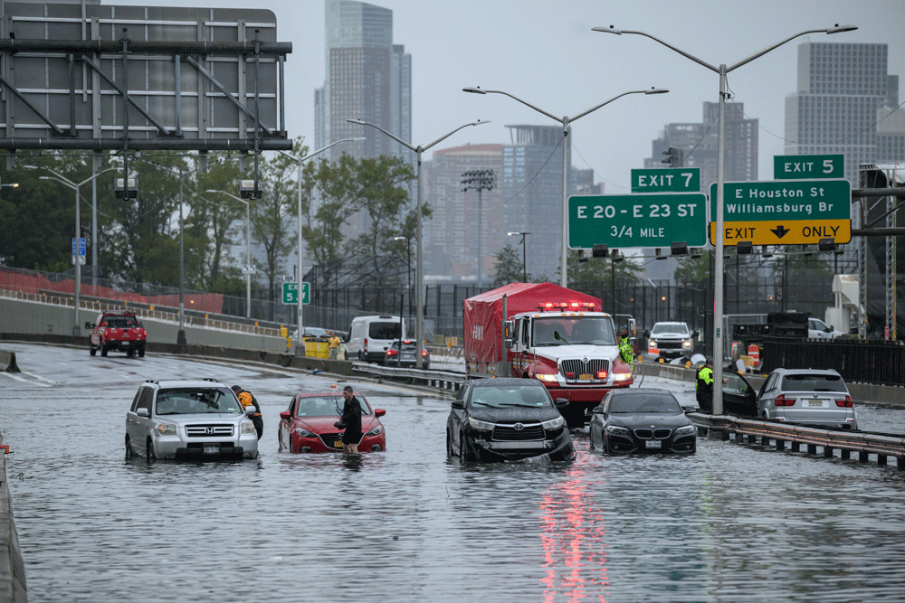
  
<em>Source: AFP</em>

---

## Importance of forecasting

- Forecasts give us days, up to a week, to prepare for extreme weather like heat waves
- Gives us time to:
    - Change travel plans ✈️🚢
    - Stock up on supplies 📦
    - Prepare for power outages 💡
    - Set up cooling centers 🌡️
    - Prevent heat-related illness and death 🚑
- **Forecasts save lives!**

---

## Forecasting in the U.S.

- The **National Weather Service** (NWS) is responsible for issuing forecasts, watches, and warnings in the U.S.
    - Plenty of other companies and organizations make forecasts, like the weather app on your phone
- Forecasters use a combination of **observations**, **forecast models**, and their own experience to make forecasts

---

  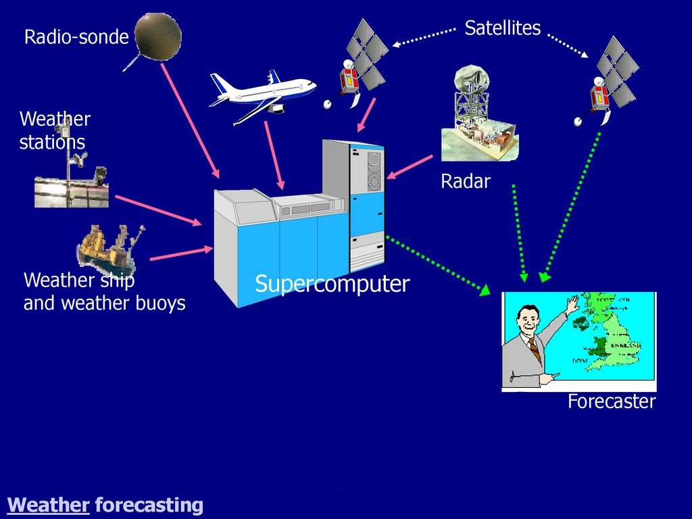
  
<em>Source: Conrad Goodman</em>

---

## In the rest of this talk, we will cover:
1. Observations
    - Radar, satellite, upper air, and surface observations
2. Forecast models
    - How do they work? How do we interpret them?

- Activities throughout!

---

# Part I: Observations

---

## Radar basics

- Radar stands for **Ra**dio **D**etection **A**nd **R**anging
- How it works:
    1. Radar sends out a pulse of energy
    2. Energy bounces off of objects in the atmosphere
    3. Radar receives the energy that bounces back
- What makes it useful:
    - **It can tell us where precipitation (rain, snow, or hail) is falling!**

---

  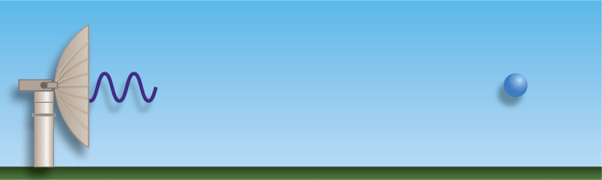
  
<em>Source: NOAA</em>

---

## Radar basics
- Three important quantities from radar:
    1. Reflectivity
        - How much energy is bouncing back to the radar
        - **Higher reflectivity =  larger particle size**
    2. Time delay
        - How long it takes for the energy to bounce back
        - **Shorter time delay = closer to the radar**
    3. Elevation angle
        - The angle at which the radar is pointing
        - **Lower elevation angle = closer to the ground**

---

  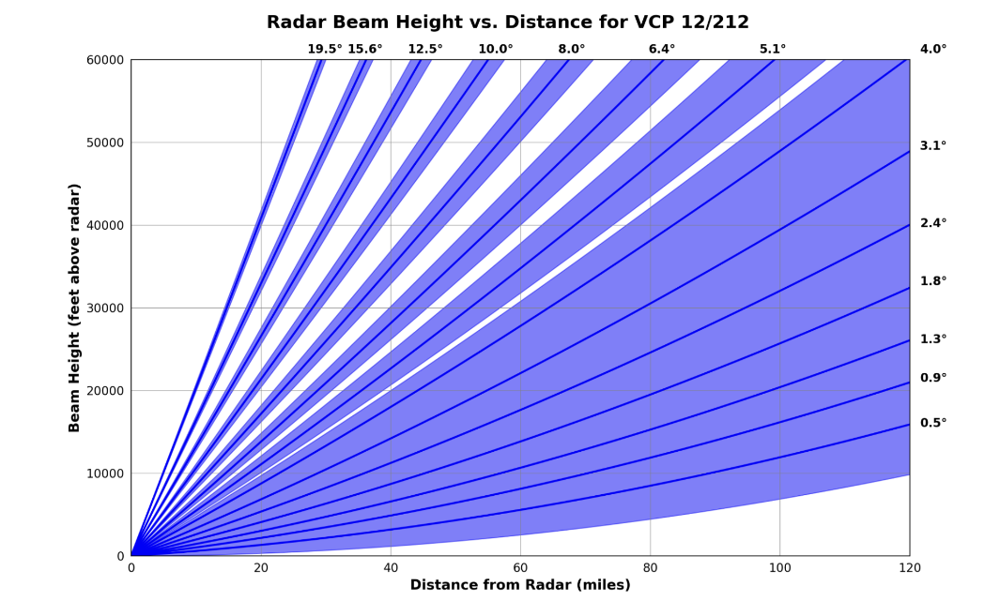
  
<em>Source: NOAA</em>

---

## Radar images
- All the data from radar is combined to make images like this:

  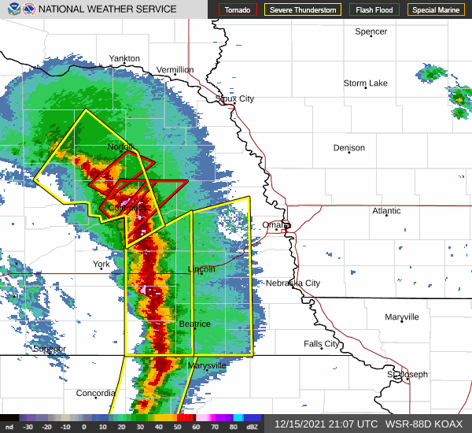
  
<em>Source: NOAA</em>

---

## Radar Activity
- Go to [radar.weather.gov](https://radar.weather.gov) and view the nation radar loop
- Can you find the following?:
    - An area of **heavy** precipitation
    - An area of **light** precipitation
    - A thunderstorm
    - A *line* of precipitaiton
- If NWS radar isn't working, try College of DuPage's [radar site](https://weather.cod.edu/satrad/?parms=continental-conus-comp_radar-24-0-100-1&checked=map&colorbar=undefined)

---

## Satellites

---

## Satellite basics
- Satellites capture images of the Earth from space
- How it works:
    1. Satellite takes a picture of the Earth
    2. Picture is sent back to Earth
    3. Picture is combined with other pictures to make an image
- Satellites can see clouds and smoke, which radar cannot
- Satellites don't only see visible light, they can see other wavelengths too!
    - Helps us measure temperature, moisture, etc.

---

  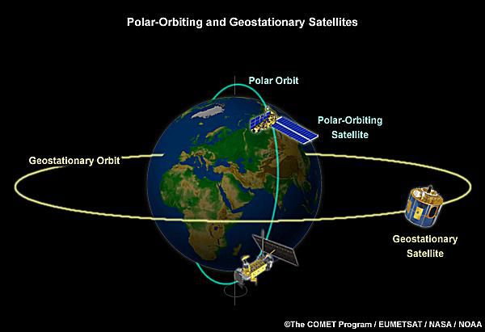
  
<em>Source: ThoughtCo</em>

  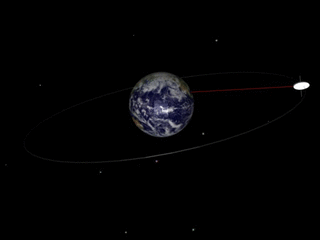
  
<em>Source: Wikimedia Commons</em>

---

## Question: How far away do you think geostationary satellites are from Earth?
- A) 200 miles
- B) 2,000 miles
- C) 20,000 miles
- D) 200,000 miles

---

## Types of satellite imagery
- Visible Imagery:
    - Shows clouds and surface features *during the day only*
    - Like a photo taken from space
- Infrared (IR) Imagery:
    - Measures temperature of clouds and surface
    - Can see clouds and surface features *day and night*!
- Water Vapor Imagery:
    - Measures moisture in the atmosphere
    - Good for finding areas of dry air and moisture
---

## Visible imagery
- Light colors = clouds, dark areas = clear skies
- Can see details like cloud shapes and sizes

  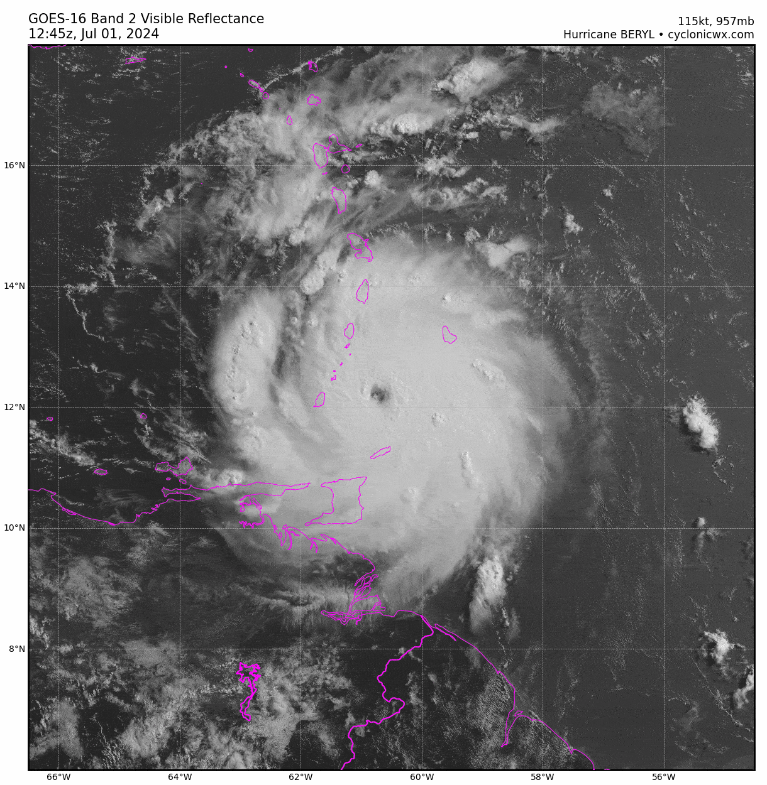
  
<em>Source: WeatherTiger</em>

---

## Infrared imagery
- Different colors = different temperatures
- Colder temps = higher clouds = red/white
- Warmer temps = lower clouds = blue/green

  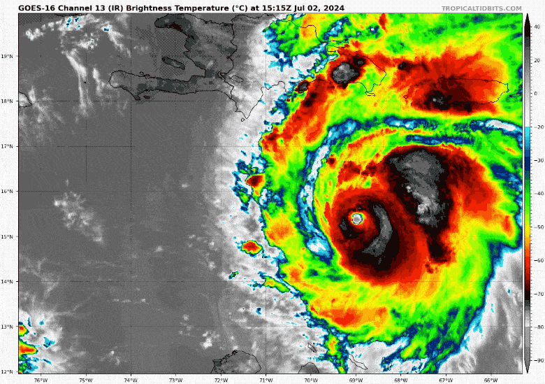
  
<em>Source: Just In Weather</em>

---

## Water vapor imagery
- Different colors = different moisture levels
- White, blue, and green = moist air
- Yellow, orange, and red = dry air

  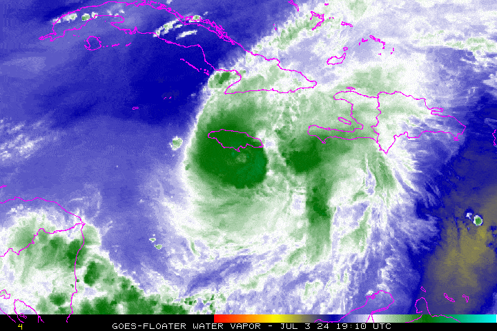
  
<em>Source: Just In Weather</em>

---

## Satellite imagery & extreme heat
- Satellites help us:
    - **Monitor heatwaves** by tracking areas of clear skies and dry air
    - **Identify urban heat islands** by comparing temperatures in cities to surrounding areas
    - **Assess droughts** by viewing soil moisture and vegetation health
    - **Create long-term records** of temperature and moisture

---

## Satellite activity

- Go to [weather.cod.edu](https://weather.cod.edu/satrad)
- Using bands 01-02 (visible), 14 (IR), and 08 (water vapor), try finding:
    - an area of high clouds
    - an area of low clouds
    - fog
    - a moisture plume
    - a dry air plume

---

## Upper air observations

---

## Upper air observations basics
- Measurements taken directly from the atmosphere
- Essential for understanding and predicting weather
- Collected via:
    - Weather balloons (radiosondes)
    - Aircraft

---

## Weather balloons and radiosondes
- Weather balloons carry radiosondes into the atmosphere
- Radiosondes measure:
    - Temperature
    - Humidity
    - Pressure
    - Wind speed and direction
- Data is sent back to the ground via radio

---

  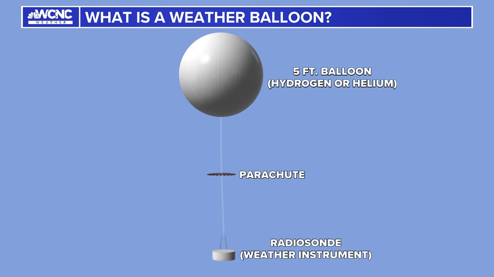
  
<em>Source: WCNC</em>

---

  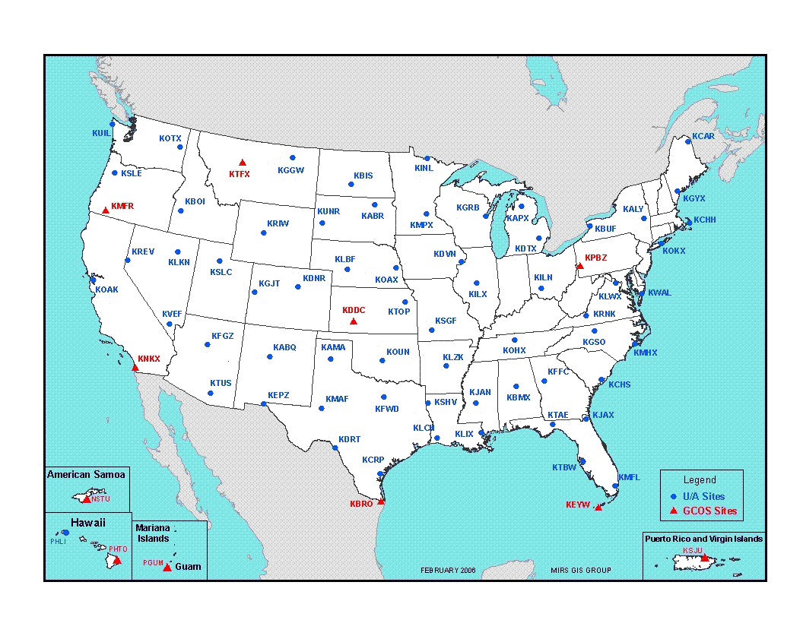
  
<em>Source: NWS</em>

---

## Reading upper air observations
- Show vertical profiles of temperature, moisture, and wind
  - **Temperature**: red line
  - **Dew point**: green line
  - **Wind speed**: barbs
  - **Wind direction**: direction barbs point
- Temperature and dew point are close = clouds (usually)!
- Temperature increases with height = inversion

---

## Example: San Diego, CA

  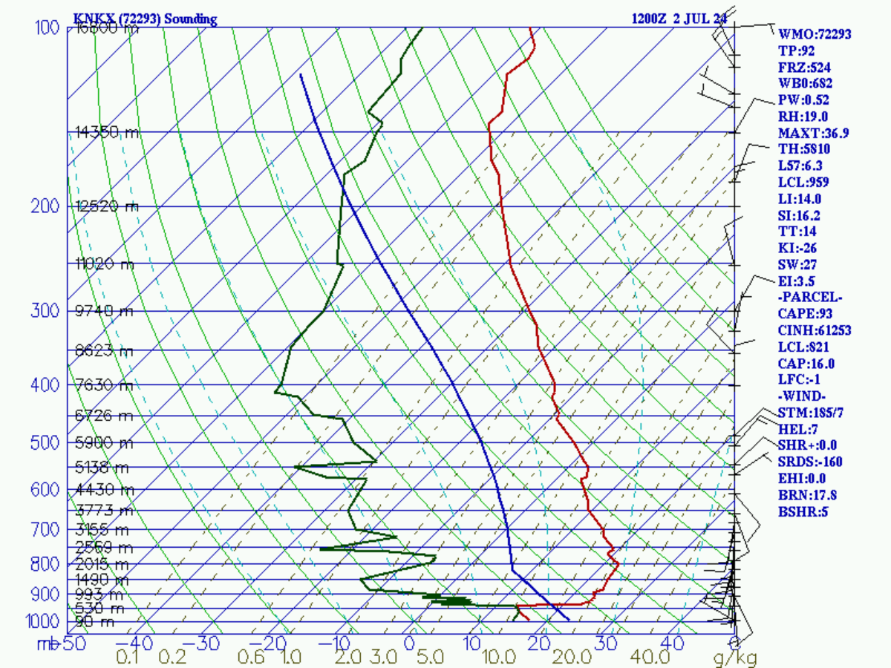
  
<em>Source: College of Dupage</em>

---

## San Diego Harbor

  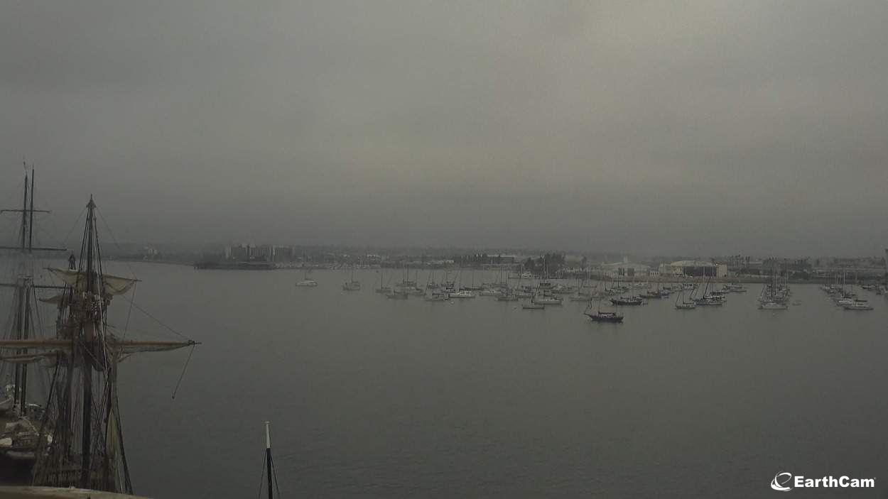
  
<em>Source: EarthCam</em>

---

## Upper air observations & heat waves
- Upper air observations help us:
    - **Monitor heatwaves** by tracking areas of warm air aloft
    - **Detect inversions** that can amplify heat in cities
    - **Assess humidity** by tracking moisture in the atmosphere
    - **Create long-term records** of temperature and moisture

---

## Upper air activity

- Go to the Storm Prediction Center's [soundings page](https://www.spc.noaa.gov/exper/soundings/)
- Can you find the following?:
  - A sounding with a temperature inversion 🌡️
  - A sounding with a dry layer 🏜️
  - A sounding with thick clouds 🌥️
  - A sounding with clouds near the surface (fog) 🌫️

Need help finding some of the features? Check out the 🛰️ imagery ;)

---

## Surface observations

---

## Surface observations basics
- Measurements taken at the Earth's surface
- Essential for understanding and predicting weather
- Collected via:
    - Automated weather stations 
    - Manual observations 
    - Ships and buoys
- Measure a lot of the same things as upper air observations (temp, humidity, wind, pressure, etc.)

---

## Station symbols
- Surface observations are plotted on a map using station symbols

  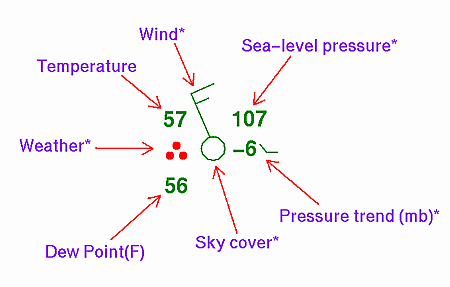
  
<em>Source: NOAA WPC</em>

---

## There are also a ton of different weather symbols! 🌦️🌪️🌈

  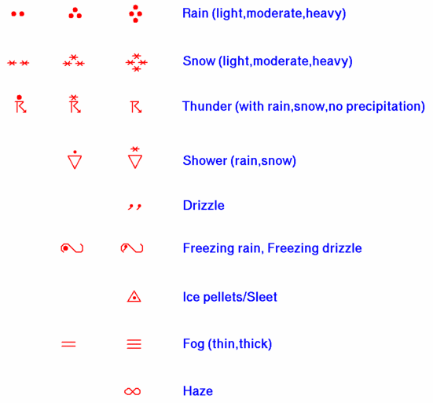
  
<em>Source: NOAA WPC</em>

---

## Surface map analyses - Fronts and symbols

  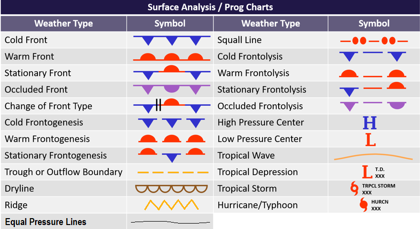
  
<em>Source: Aviation Weather</em>

---

## Putting it all together...

  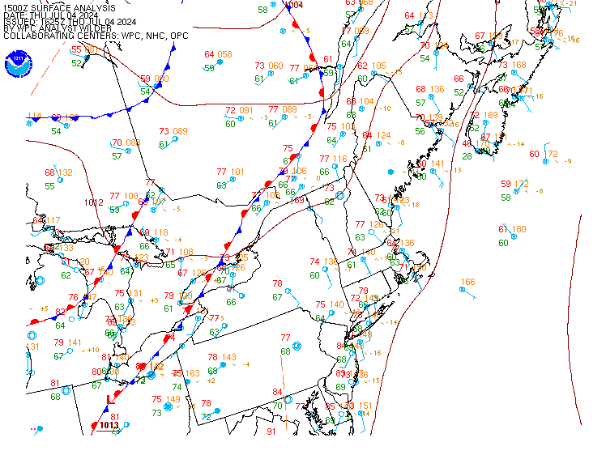
  
<em>Source: NOAA WPC</em>

---

## Surface observations activity
- Go to the [Weather Prediction Center's surface analysis page](https://www.wpc.ncep.noaa.gov/html/sfc-zoom.php)
- Find the station closest to NYC (Newark Airport)
- What's the:
  - Temperature?
  - Dewpoint?
  - Wind speed and direction?
  - Pressure?
  - Weather & cloud cover?
- Are there any fronts in the area? What about low or high pressure systems?

---

# Part II: Forecast models

---

## What are weather forecast models?
- Computer programs that predict the weather
- They use:
    - **Observations** to start the simulation
    - **Physical equations** to simulate the atmosphere
    - **Math** to solve the equations
- Run on supercomputers and produce a lot of data! 🤯

---

## Types of forecast models
- **Global models**:
    - Cover the entire globe, run every 6-12 hours
    - Produce forecasts out to 16 days
    - Examples: GFS (Global Forecast System), ECMWF (European Centre for Medium-Range Weather Forecasts)
- **Regional models**:
    - Cover smaller areas, run more frequently
    - Produce forecasts out to 3-5 days
    - Examples: NAM (North American Mesoscale), HRRR (High-Resolution Rapid Refresh)

---

  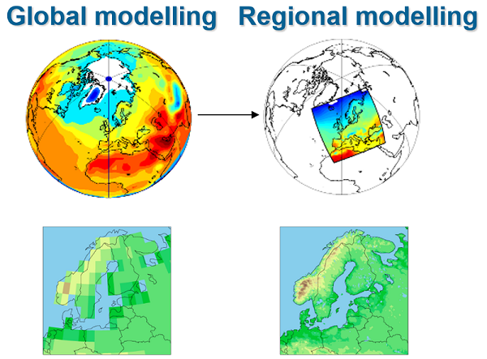
  
<em>Source: Copernicus</em>

---

## How do forecast models work?
- **Data collection**: Gather data from satellites, weather stations, balloons, etc.
- **Data assimilation**: Combine observations with model data to create a starting point for the model
- **Model integration**: Run the model forward in time
- **Post-processing**: Take the model output and make it easier to understand
- **Verification**: Compare model output to observations to see how well the model did (sometimes)

---

## Why aren't forecasts from models perfect? 🤔
- Models are not perfect because:
    - **Observations are not perfect**
        - Missing data, errors, etc.
    - **Physical equations are not perfect**
        - Simplifications, approximations, etc.
    - **Math is not perfect**
        - Round-off errors, etc.
    - **The atmosphere is chaotic** 🌪  ️

---

[

  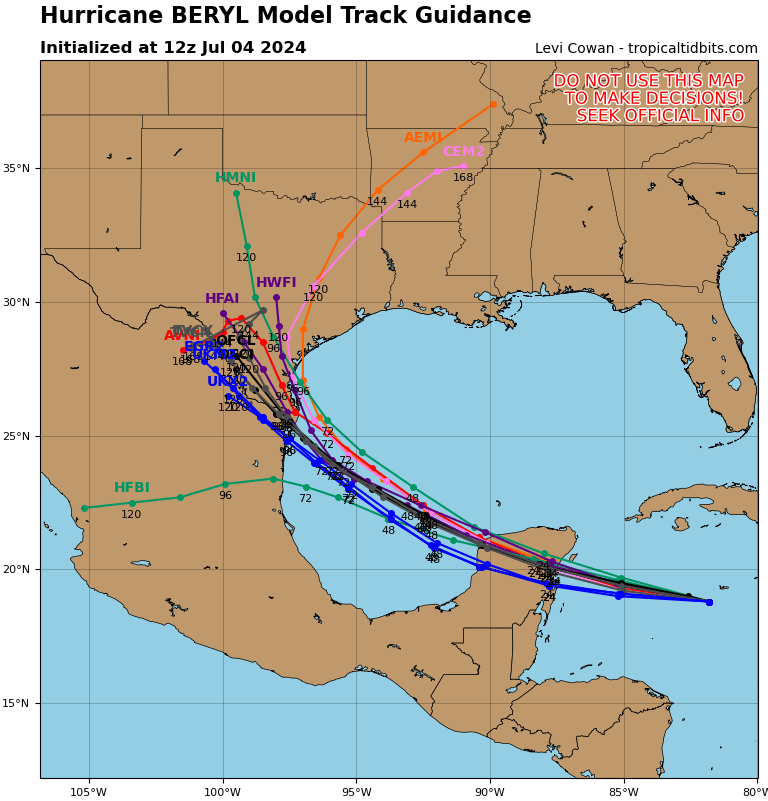
  
<em>Source: Copernicus</em>

](nhc.noaa.gov)

---

## Reading model output
- Model output is available online for free from so many sources
- Most data is displayed on a map
  - Temperatures, winds, precipitation, etc.
- Some websites like you create soundings and cross-sections
- Enough of that, let's look at some model output! 🤓

---

## Forecast model resources
- [NOAA Model Analysis and Guidance (MAG)](https://mag.ncep.noaa.gov/)
- [Tropical Tidbits](https://www.tropicaltidbits.com/) 
- [Pivotal Weather](https://www.pivotalweather.com/) 
- [College of DuPage](https://weather.cod.edu/forecast/)
-  Lots of apps like [Windy](https://www.windy.com/)

---

## Key indicators for predicting heat waves
- **High tempertures**
  - Look for sustained high temperatures over several days
  - Check temperature anomalies (difference from normal)
- **High pressure systems**
  - Traps warm air and prevents cooling
  - Look for the large "H" on surface maps
- **Humidity levels**
  - High humidity makes it feel hotter
  - Look for dew points in the 70s and 80s
- **Wind patterns**
  - Light winds lead to stagnant air and heat build-up

---

## Forecast Model Activity: Make your own NYC forecast
- Work with a partner to make a forecast for NYC for the next two days
- Use the following resources:
    - [College of DuPage](https://weather.cod.edu/forecast/)
    - [Pivotal Weather](https://www.pivotalweather.com/)
    - [Tropical Tidbits](https://www.tropicaltidbits.com/)
- Determine the following for the next two days (7/9 and 7/10):
    - High and low temperatures
    - Chance of precipitation, if > 0%, what type? (rain, thunderstorms, etc.) How much?
    - Wind speed, direction, and cloud cover
    - Humidity (dewpoint)

---

## Forecast Model Activity: Finding heat waves
- We are currently in a heat wave in NYC!
- Using the same resources, can you find an area in the U.S. that is experiencing or will experience a heat wave in the next 7 days?
- What makes you think it's a heat wave?
- Is the heat wave expected to last for a long time? How long?

---

## Conclusion

---

## Recap
- In this talk, we covered:
    - Observations:
        - Understanding radar, satellite, upper air, and surface observations
        - Interpreting data to determine current weather conditions
    - Forecast models:
        - How weather forecast models predict the weather
        - How to read and interpret model output

---

## Importance of weather forecasts:
- **Safety and preparedness**
  - Helps in planning and staying safe during extreme weather events
- **Public health**
  - Important for issuing heat advisories and protecting vulernable populations
- **Climate awareness**
  - Enhances understanding of weather patterns and climate change impacts

---

## Explore further
- **Practice!**
  - Try making your own forecasts and see how they compare to actual weather
- **Learn more**
  - Read NWS forecast discussions
  - Connect with local NWS offices and meteorologists on social media
  - Consider majoring in meteorology or atmospheric science 😁

---

## Addition resources
- [NOAA Jetsream](https://www.weather.gov/jetstream/)
- [Comet MetEd](https://www.meted.ucar.edu/)
- [Other NWS Educator Resources](https://www.weather.gov/owlie/educate)

---

## Thank you!

- **Contact me:**
  - Email: [tjanoski@ccny.cuny.edu](mailto:tjanoski@ccny.cuny.edu)

---

## If we have time...
- Let's go through how I make a forecast for NYC