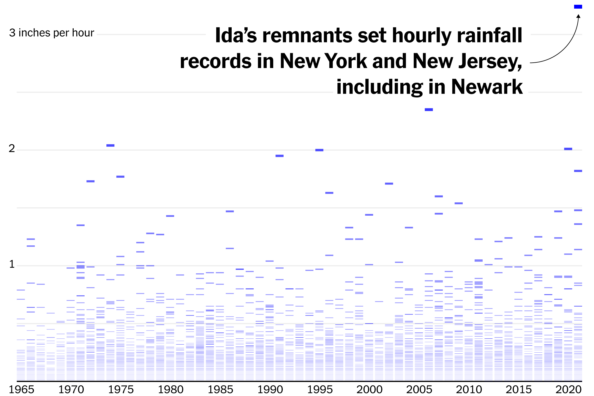
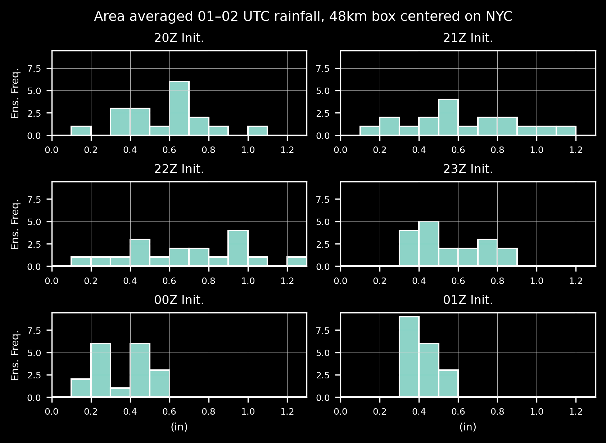
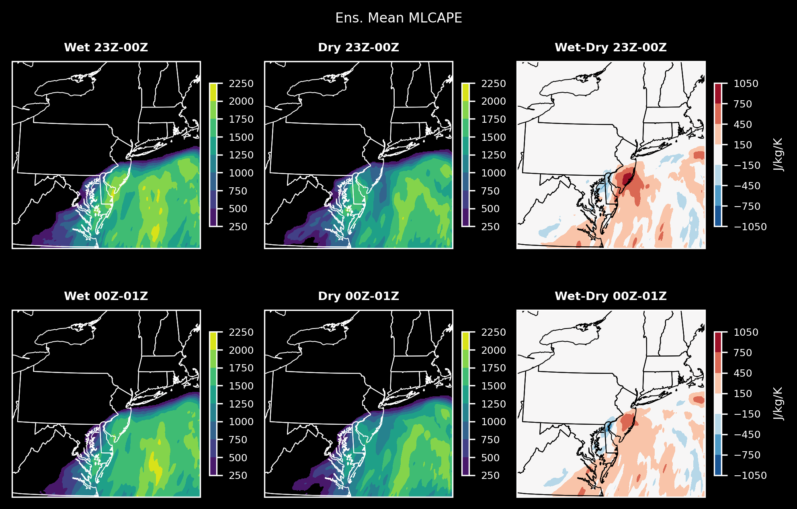
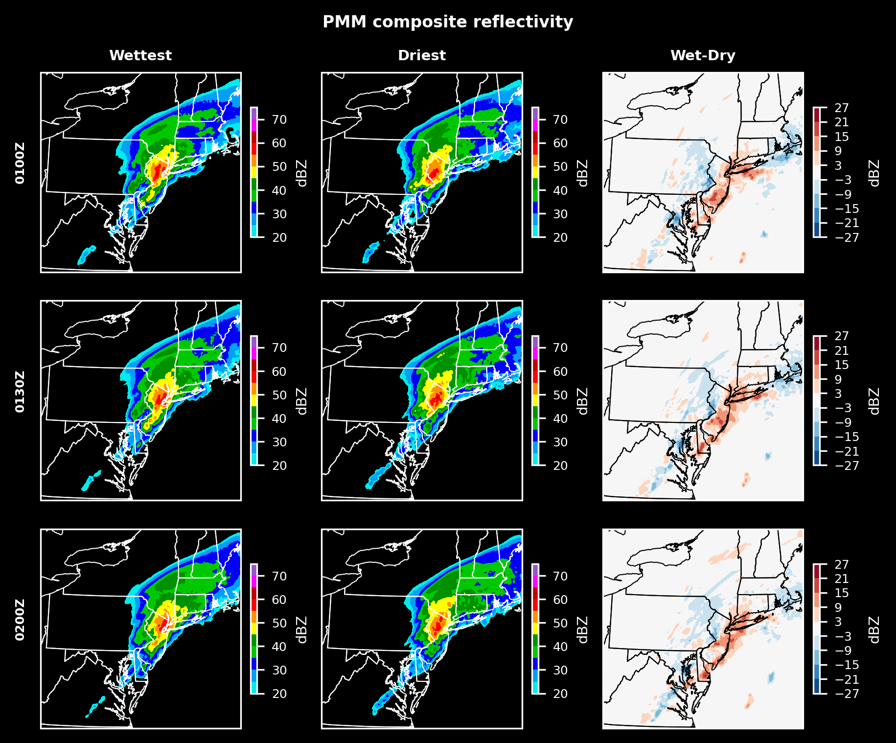

# Exploring Extreme Rainfall from Hurricane Ida using the Warn-on-Forecast System

Ty Janoski1,2, James Booth1, Thomas Galarneau2

1City College of New York
2NOAA National Severe Storms Laboratory

<!-- theme: gaia -->

---

## Background --  Ida
- Many of us are already familiar with the impacts of Hurricane Ida on the New York City area
- Dozens of deaths, widespread flooding, and significant damage
- Suffice it to say, it is worth studying

---

  
  
<em>Source: New York Times</em>

---

## Background: Warn-on-Forecast System (WoFS)
- High-resolution (3km), convection-allowing model ensemble system
- Produces probabilistic forecasts of severe weather
- Assimilates radar, satellite, and surface observations
- Run every hour starting at 17Z
    - 6-hour long forecasts

---

  
  
<em>Source: WoFS Cloud-based Web Viewer</em>

---

## Research Questions
1. **What are the main factors *across scales* that contributed to the extreme rainfall from Ida?**
2. In what ways was Ida unique compared to other extreme rainfall events in the New York City area?
3. What lessons can we learn from Ida to improve our understanding and prediction of extreme rainfall in the New York City area?

---

## Methodology

- Analyze retrospective WoFS forecasts of Ida
- Separate the forecasts into two groups based on the average 01–02 UTC rainfall in the New York City area
    - The **5 wettest** and **5 driest** ensemble members from *each* of the 20Z, 21Z, 22Z, and 23Z initializations
- Compare the two groups to identify the main factors that contributed to the extreme rainfall

---

  
  
<em></em>

---

## Sample Results

  
  
<em></em>

---

  
  
<em></em>

